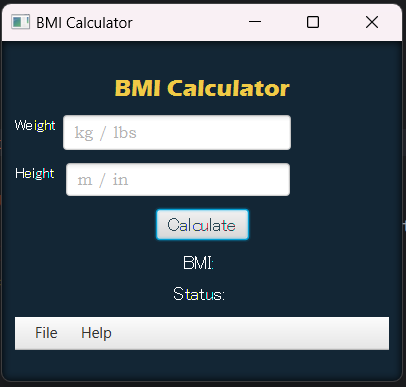

# BMI Calculator
Description
This is a JavaFX application designed to calculate Body Mass Index (BMI).
Users can enter their weight and height, and the program computes the BMI, displaying the corresponding status (e.g., underweight, normal weight, or overweight). 
The application supports both metric and imperial measurement systems, automatically calculating BMI for English units when appropriate, making it user-friendly for different audiences.

## Features
- Input for weight and height in multiple formats (kilograms, centimeters).
- Automatically calculates BMI when height and weight are entered in English units (e.g., pounds and inches).
- Calculates BMI and provides a corresponding health status.
- User-friendly interface with JavaFX.
- Menu options for clearing input, exiting the application, and displaying information about the app.
- Error handling and data validation to ensure correct user input.

## Main Files
**hello-view.fxml: Contains the graphical user interface layout.**

Includes input fields for weight and height.
Contains a button to calculate BMI.
Displays results through labels.
Features a menu with options:
- Clear: Clears input fields.
- Exit: Closes the application.
- About: Displays information about the application.

**HelloApplication.java: The main class of the application.**

- Loads the FXML interface and displays the window.
- Key commands include loading the interface, creating the scene, setting the title, and showing the stage.

**HelloController.java: Manages the application logic.**

- calculateBMI(): Calculates BMI based on user input.
- Supports input in both imperial and metric units.
- Displays results and handles errors with alert messages.
- onClear(): Clears the input fields.
- onExit(): Closes the application.
- onAbout(): Displays information about the BMI calculator.

## Error Handling and Data Validation
The application includes mechanisms to handle input errors through alert dialogs. 
If the user enters invalid data, an error message is displayed. Other unforeseen exceptions are also handled to prevent crashes.

## Usage of Java OOP Principles
The program follows key object-oriented programming principles:

*Encapsulation*: Fields and methods are organized within the HelloController class.
*Modularity*: Logic is separated from the user interface for better maintainability.
*Reusability*: Helper methods, such as bmiStatusLabel(), can be utilized throughout the application.

## Code Organization and Documentation
The program is structured into several classes for clear separation of responsibilities:

*HelloApplication*: Manages the application's lifecycle.
*HelloController*: Contains the logic for handling user interactions.
*hello-view.fxml*: Responsible for the user interface design.
Code comments are provided to facilitate understanding of the program's functionality.

## Conclusion
This BMI calculator application effectively computes BMI with support for various units of measurement.
Users can clear input fields, exit the program, or access information about the app through the menu. 
The application leverages JavaFX for a user-friendly interface, incorporating good error handling and adherence to OOP principles.

## How to Run
To run this application, ensure you have JavaFX set up in your development environment. 
Clone this repository, and use an IDE like IntelliJ IDEA or Eclipse to run the HelloApplication.java file.

